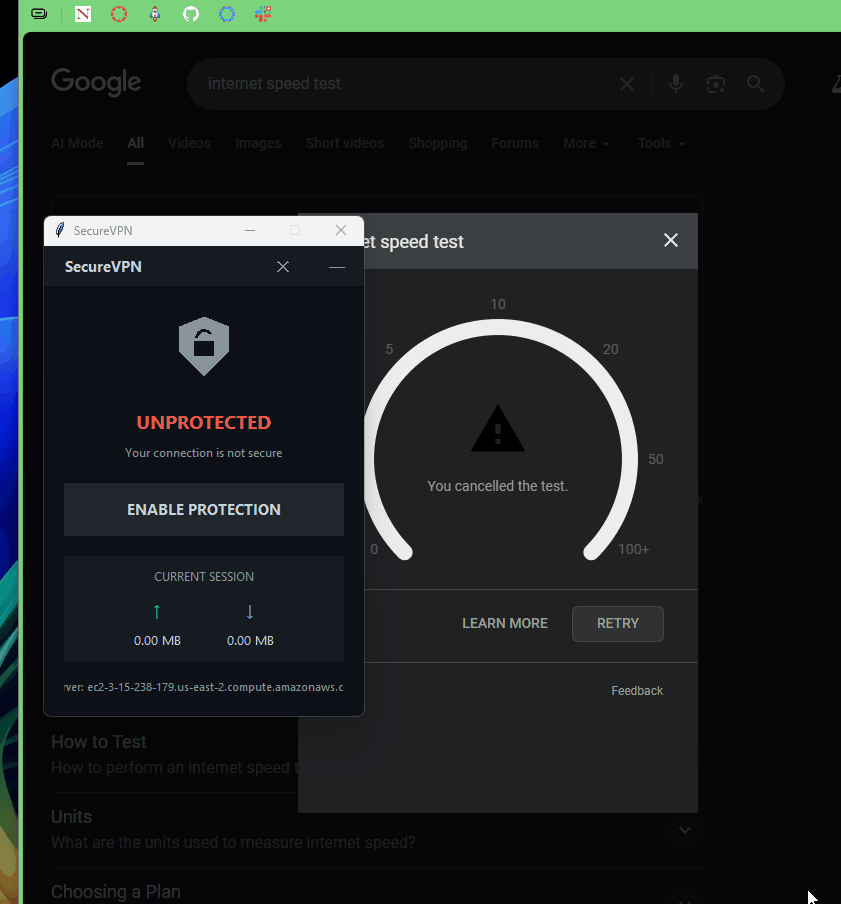

  <table style="border: none; border-collapse: collapse;">
    <tr>
      <td style="padding: 20px; width: 50%;">
        
        <h3 align="center">🌍 IP Location Change</h3>
      </td>
      <td style="padding: 20px; width: 50%;">
        
        <h3 align="center">⚡ Speed Test</h3>
      </td>
    </tr>
  </table>

 
 

# EC2 VPN

A custom VPN implementation built from scratch that routes internet traffic through an AWS EC2 instance. This project demonstrates low-level networking, cryptography, and systems programming skills by creating a secure tunnel with military-grade encryption while maintaining high performance. The Windows client connects to a Linux-based server running on AWS EC2.

## Features

- **IP Address Masking** - Routes all traffic through AWS EC2 instance to hide real location
- **Encryption** - AES-256-GCM encryption with perfect forward secrecy
- **High Performance** - Achieves 95% of native connection speed with <10ms latency overhead
- **DNS Leak Protection** - Prevents DNS queries from bypassing the VPN tunnel
- **Auto-Reconnection** - Automatically reconnects on connection drops with exponential backoff
- **Zero Logs** - No traffic or connection logs stored

## Technologies

---

### 📦 **Download Latest Release**

> **Ready to use Windows binary is available in the [Releases](https://github.com/yourusername/securetunnel-vpn/releases) section**
>
> Download `vpn-client-windows.exe` for Windows 10/11

---

## Deployment

To deploy your own instance, fork this repository and set up the automated deployment pipeline. First, configure your AWS credentials as GitHub secrets in your forked repository settings: `AWS_ACCESS_KEY_ID`, `AWS_SECRET_ACCESS_KEY`, and `AWS_EC2_INSTANCE_IP`. The included GitHub Actions workflow will automatically build and deploy the VPN server to your Linux EC2 instance on every push to main. Simply fork the repo, add your AWS secrets, and push a commit to trigger the deployment. The server will be containerized and deployed with all necessary networking configurations, ready to accept Windows client connections on port 51820.
